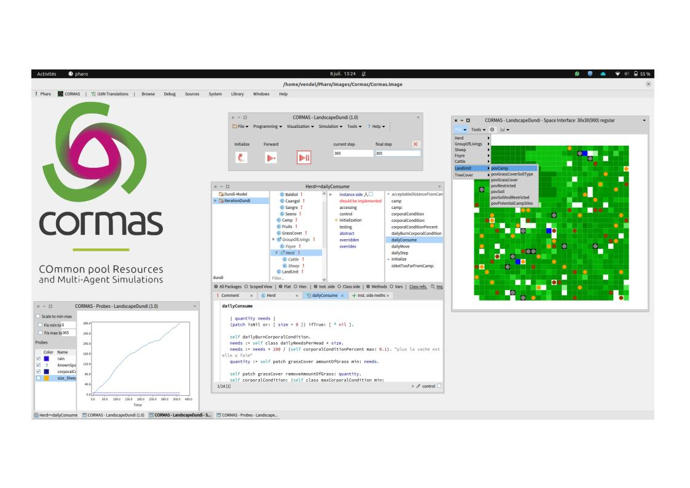
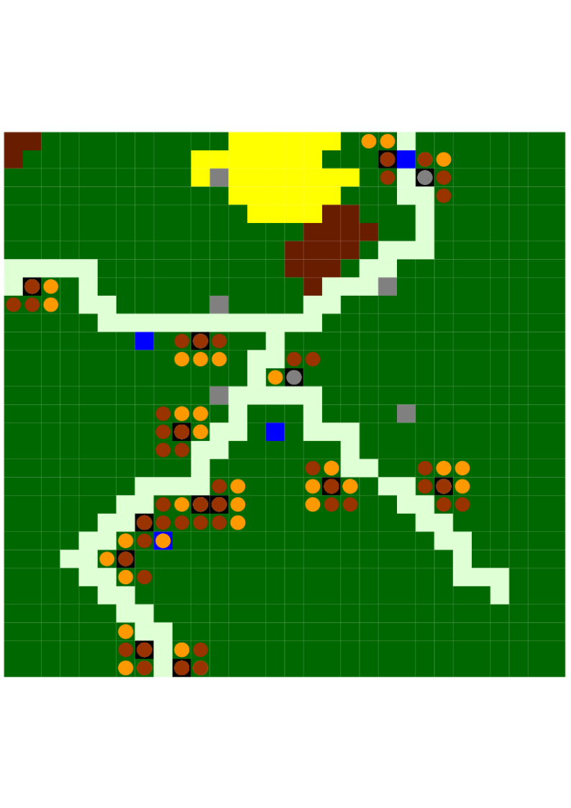
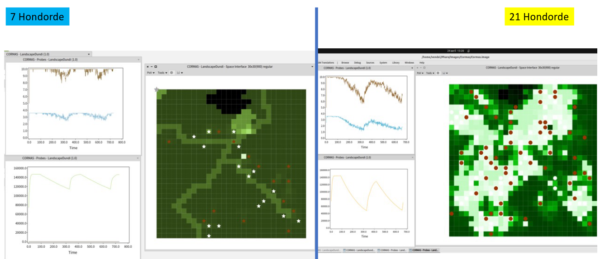

# Dundi Ferlo Model

## How to Load It?

First of all, you must get youself a Cormas image. To do that, follow instructions on [Cormas repository](https://github.com/cormas/cormas?tab=readme-ov-file#standard-installation).
In your Cormas image, run the following Metacello script to install the model:

```st
Metacello new
    repository: 'github://panchovdl/DundiModel';
    baseline: 'DundiModel';
    load
```

## Screenshots




